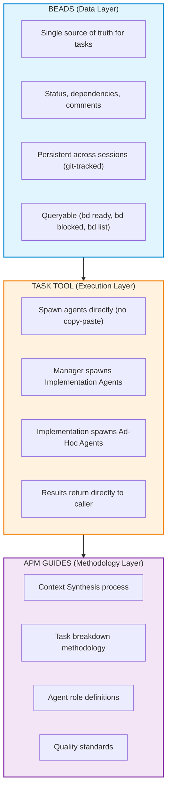
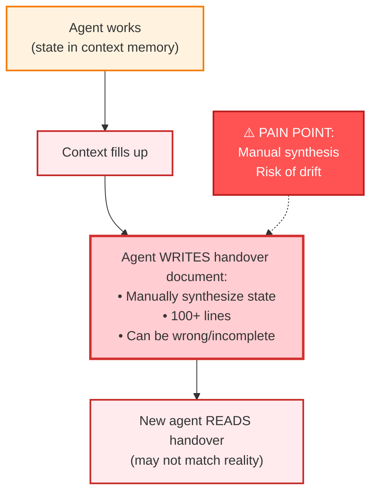
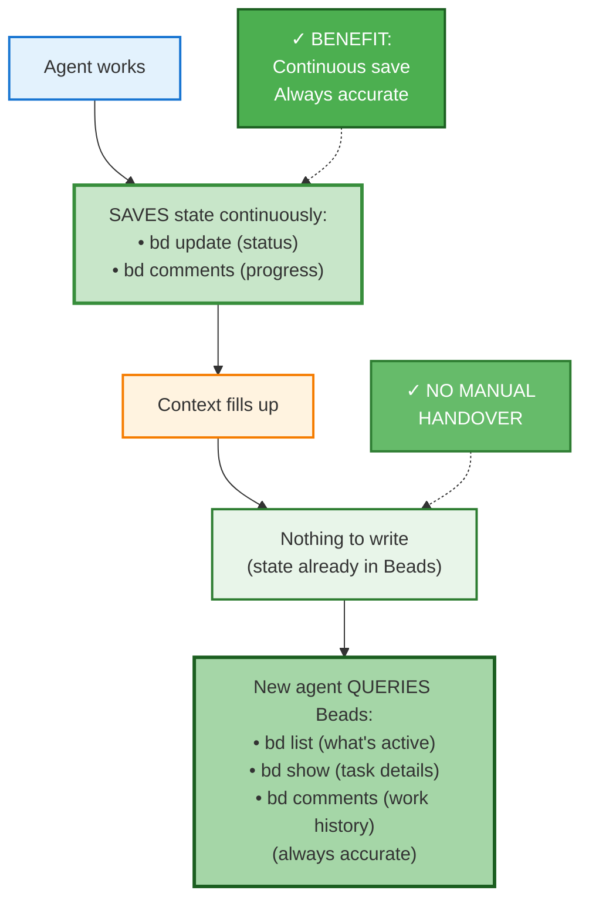

# Beads + APM Integration

## Overview

This document describes the integration of **Beads** (issue tracking) with **APM** (Agentic Project Management) methodology.

---

## Problem Statement

### Current APM Pain Points

| Problem | Description |
|---------|-------------|
| **MD file sync** | Implementation_Plan.md, Memory Logs, and actual state can drift apart |
| **Copy-paste friction** | Task assignments, handovers, and delegations require manual copy-paste between sessions |
| **Manual state synthesis** | Agents must manually write long handover documents from memory |
| **No queryable state** | Cannot easily ask "what's blocked?" or "what's ready?" |

---

## Solution Architecture

### Separation of Concerns



### Core Principle

- **Beads** = Where data lives (tasks, status, history)
- **Task Tool** = How agents spawn other agents
- **APM Guides** = How to think about work (methodology only)

### Guide Files Reference

The `.apm/guides/` directory contains detailed methodology guides for each workflow phase:

| Guide | Purpose | Used By |
|-------|---------|---------|
| **Context_Synthesis_Guide.md** | Four-round requirements gathering methodology | Setup Agent (during /apm-setup) |
| **Project_Breakdown_Guide.md** | Transform requirements into Beads issues | Setup Agent (during /apm-setup) |
| **Project_Breakdown_Review_Guide.md** | Optional systematic task quality review | Setup Agent (user-selected) |
| **Agent_Discovery_Guide.md** | Discover and select appropriate agents | Setup Agent & Manager Agent |
| **Task_Assignment_Guide.md** | Dependency context and agent spawning details | Manager Agent |
| **Agent_Workflow_Guide.md** | Day-to-day Beads and Task tool usage | Manager & Implementation Agents |

**Quick Navigation:**
- Setting up a project? → Start with Context_Synthesis_Guide.md
- Breaking down work? → See Project_Breakdown_Guide.md
- Assigning tasks? → Reference Agent_Discovery_Guide.md + Task_Assignment_Guide.md
- Daily workflow? → Use Agent_Workflow_Guide.md

---

## Component Mapping

### What Replaces What

| APM Component | Beads Replacement | Notes |
|---------------|-------------------|-------|
| Implementation_Plan.md (task store) | Beads issues + epics + dependencies | Plan becomes queryable |
| Memory Logs | `bd comments` on tasks | Saved during work, not after |
| Task status tracking | `bd update --status=` | open, in_progress, blocked, closed |
| Handover documents | `bd` queries | No manual synthesis needed |
| Cross-agent dependencies | `bd dep add` | Automatic blocking detection |
| Phase tracking | Beads epics | `bd epic status` for progress |
| Manager coordination notes | Meta-issue with comments | `manager-notes` issue |

### What APM Keeps

| APM Component | Purpose | Status | See Guide |
|---------------|---------|--------|-----------|
| Context_Synthesis_Guide | How to gather requirements | Keep | `.apm/guides/Context_Synthesis_Guide.md` |
| Project_Breakdown_Guide | How to decompose work | Keep | `.apm/guides/Project_Breakdown_Guide.md` |
| Project_Breakdown_Review_Guide | Optional systematic review | Keep | `.apm/guides/Project_Breakdown_Review_Guide.md` |
| Task_Assignment_Guide | What makes good task specs | Keep (modify for Beads) | `.apm/guides/Task_Assignment_Guide.md` |
| Agent_Discovery_Guide | Agent selection framework | Keep | `.apm/guides/Agent_Discovery_Guide.md` |
| Agent_Workflow_Guide | Day-to-day operations | Keep | `.apm/guides/Agent_Workflow_Guide.md` |
| Memory_Log_Guide | How to document work | Replace with Beads conventions | (See Agent_Workflow_Guide.md) |
| Memory_System_Guide | How memory is organized | Replace with Beads conventions | (See Agent_Workflow_Guide.md) |
| Agent role definitions | Who does what | Keep | (See all guides) |

---

## Beads Issue Structure

### Issue Types

| Type | APM Equivalent | Usage |
|------|----------------|-------|
| `epic` | Phase | Group of related tasks |
| `task` | Task | Single unit of work |
| `feature` | Feature task | New functionality |
| `bug` | Bug fix task | Defect repair |
| `chore` | Meta/admin | Coordination notes, cleanup |

### Agent Assignment via Assignee Field

Agent assignment uses the `--assignee` (`-a`) field in Beads (see `Agent_Discovery_Guide.md` for complete agent selection framework):

```bash
# Built-in agents (always available)
-a general-purpose   # Implementation tasks (write/edit/bash access)
-a explore          # Quick codebase exploration (fast, read-only)
-a plan             # Research & planning (read-only + web search)

# Custom agents (if defined in .claude/agents/)
-a database-specialist
-a frontend-specialist
```

**Complete Agent Selection Framework:**

See `Agent_Discovery_Guide.md` for:
- Full decision framework for matching tasks to agents
- Custom agent discovery process (`find .claude/agents`)
- Agent capability matrices and use cases
- Manager and Setup Agent usage patterns

**Quick Decision Tree:**
1. Does task modify the system? → `general-purpose` or custom implementation agent
2. Does task require planning/research with web access? → `plan`
3. Is this quick read-only exploration? → `explore`
4. Is there a matching custom agent? → Use custom agent (discover via Agent_Discovery_Guide.md)

**Detailed guidance:** See `Agent_Discovery_Guide.md` §2 "Agent Selection Guidance"

### Labels for Domain Categorization

Use labels for logical domain grouping (flexible naming):

```bash
# Domain labels (examples - adapt to your project)
auth              # Authentication/authorization work
api               # Backend API development
ui                # Frontend user interface
testing           # Test development
database          # Database migrations/schema
dependencies      # Dependency management

# Meta labels
manager-meta      # Manager coordination notes
has-findings      # Task has important discoveries
blocked-external  # Blocked by external factor
```

**Key Principle:** Assignee = who does the work. Labels = categorization.

### Issue Description Format

For tasks that need detailed specs (like APM Task Assignment):

```markdown
## Objective
[One sentence goal]

## Requirements
- [Requirement 1]
- [Requirement 2]

## Acceptance Criteria
- [Criterion 1]
- [Criterion 2]

## Guidance
[Technical notes, constraints, approach suggestions]
```

### Dependencies

```bash
# Task B depends on Task A (A blocks B)
bd dep add <task-B> <task-A>

# View what blocks a task
bd show <task-id>

# View all blocked tasks
bd blocked
```

---

## Workflow: Setup Phase

### Current APM Setup
1. Context Synthesis (Q&A)
2. Project Breakdown (create Implementation_Plan.md)
3. Optional Review
4. Enhancement
5. Manager Bootstrap prompt

### New Setup with Beads

```
1. Context Synthesis → Four-Round Discovery Methodology
        │
        ├─ Question Round 1 (iterative): Existing Material and Vision
        │    • User's deliverable type and existing materials
        │    • Current plan, vision, and important files
        │    • Iterative follow-ups until understanding complete
        │
        ├─ Question Round 2 (iterative): Targeted Inquiry
        │    • Project purpose, scope, and essential features
        │    • Work structure, dependencies, challenging aspects
        │    • Technical constraints, environment requirements
        │    • Iterative follow-ups until understanding complete
        │
        ├─ Question Round 3 (iterative): Requirements & Process Gathering
        │    • Workflow patterns and quality standards
        │    • Technical constraints and implementation preferences
        │    • Coordination requirements and review processes
        │    • Iterative follow-ups until understanding complete
        │
        └─ Question Round 4: Final Validation
             • Comprehensive summary presentation to user
             • User approval or corrections required before proceeding
        │
        [See Context_Synthesis_Guide.md for complete methodology]
        │
        ▼
2. Project Breakdown → Create Beads Structure
        │
        ├─ Create phase epics
        │    bd create --title="Phase 1: Setup" --type=epic
        │
        ├─ Create task issues
        │    bd create --title="Task 1.1 - Add BOM" --type=task \
        │      -l Agent_Dependencies \
        │      --description="[detailed spec]"
        │
        ├─ Add dependencies
        │    bd dep add task-1-2 task-1-1
        │
        └─ Create manager-notes issue
             bd create --title="Manager Coordination Notes" \
               --type=chore -l manager-meta
        │
        ▼
3. Validation
        │
        ├─ bd dep cycles     (check for circular deps)
        ├─ bd ready          (verify starting tasks exist)
        └─ bd stats          (review structure)
        │
        ▼
3a. Optional: Systematic Review (user-selected)
        │
        ├─ Agent proposes review areas based on:
        │    • High-complexity tasks (6+ steps, multi-domain)
        │    • Critical path items with multiple dependencies
        │    • User requirement integration points
        │    • Pattern concerns (template matching indicators)
        │
        ├─ User selects which phases/tasks to review:
        │    • Full phase selection
        │    • Individual task selection
        │    • Mixed combinations
        │
        ├─ Systematic analysis applied to selected areas:
        │    • Task packing violations
        │    • Classification errors (single-step vs multi-step)
        │    • Missing user requirements
        │    • Template matching patterns
        │
        └─ Pattern-based improvements to unreviewed areas
        │
        [See Project_Breakdown_Review_Guide.md for complete methodology]
        │
        ▼
4. Manager Bootstrap (simplified)
        │
        └─ Short prompt: "Query Beads for state, use Task tool to assign"
```

---

## Workflow: Manager Agent

### Responsibilities

| Responsibility | How (with Beads) |
|----------------|------------------|
| Track project state | `bd stats`, `bd epic status` |
| See what's active | `bd list --status=in_progress` |
| See what's blocked | `bd blocked` |
| Find next task | `bd ready` |
| Assign task | Task tool (spawn Implementation Agent) |
| Log decisions | `bd comments add manager-notes "..."` |
| Handover | New manager queries Beads |

### Task Assignment Flow

```mermaid
sequenceDiagram
    participant M as Manager Agent
    participant B as Beads
    participant I as Implementation Agent

    M->>B: 1. bd ready
    B-->>M: Available tasks

    M->>B: 2. bd show &lt;task-id&gt;
    B-->>M: Task details & dependencies

    Note over M: 3. Prepare task prompt<br/>with dependency context

    M->>I: Task tool spawn<br/>subagent_type="general-purpose"<br/>prompt with task details

    Note over I: Agent starts work

    I->>B: bd update &lt;id&gt; --status=in_progress
    I->>B: bd comments add &lt;id&gt; "progress notes"
    I->>B: bd close &lt;id&gt; --reason="summary"

    I-->>M: 4. Results return directly

    M->>B: bd show &lt;task-id&gt;
    B-->>M: Verify completion

    M->>B: bd comments &lt;task-id&gt;
    B-->>M: Review work history
```

### Manager Handover

**Old agent (before context fills):**
- State already saved via `bd comments add manager-notes`

**New agent (fresh session):**
```bash
# Get project state
bd stats
bd list --status=in_progress
bd blocked
bd ready

# Get coordination context
bd show manager-notes
bd comments manager-notes
```

**Handover prompt (minimal):**
```markdown
# Manager Agent Handover

## Get State
Run: bd stats, bd list --status=in_progress, bd blocked, bd ready

## Get Context
Run: bd show manager-notes, bd comments manager-notes

## Your Role
Coordinate agents, assign tasks via Task tool, log decisions to manager-notes.
```

---

## Workflow: Implementation Agent

### Responsibilities

| Responsibility | How (with Beads) |
|----------------|------------------|
| Start task | `bd update <id> --status=in_progress` |
| Log progress | `bd comments add <id> "..."` |
| Complete task | `bd close <id> --reason="..."` |
| Delegate research | Task tool (spawn Ad-Hoc) |
| Delegate debug | Task tool (spawn Ad-Hoc) |
| Handover | New agent queries Beads |

### Work Flow

```
1. Receive assignment (from Manager via Task tool)

2. Start work
   $ bd update task-xxx --status=in_progress

3. Log progress (as you work)
   $ bd comments add task-xxx "Added dependency to pom.xml"
   $ bd comments add task-xxx "Found existing auth middleware to reuse"

4. If stuck - need research
   Task(
     subagent_type="general-purpose",
     prompt="Research: [topic]. Return findings in markdown."
   )
   # Results return directly

5. If stuck - need debug (after 2 attempts)
   Task(
     subagent_type="general-purpose",
     prompt="Debug: [error]. Reproduce: [steps]. Fix it."
   )
   # Solution returns directly

6. Complete
   $ bd close task-xxx --reason="Implemented with tests passing"
```

### Implementation Agent Handover

**Old agent (before context fills):**
- State already saved via `bd update` and `bd comments`

**New agent (fresh session):**
```bash
# Get active task
bd list --status=in_progress

# Get task details and history
bd show <task-id>
bd comments <task-id>
```

**Handover prompt (minimal):**
```markdown
# Implementation Agent Handover

## Get Active Work
Run: bd list --status=in_progress
Run: bd show <task-id>
Run: bd comments <task-id>

## Your Role
Continue the in-progress task. Log progress with bd comments. Close with bd close when done.
```

---

## Workflow: Ad-Hoc Agent

### Characteristics

- **Temporary**: Spawned for specific task, ends when done
- **No Beads needed**: Results return directly to caller
- **Types**: Research or Debug

### Research Delegation

```python
# Implementation Agent spawns research agent
Task(
    subagent_type="general-purpose",
    prompt="""
    Research: Spring Security OAuth2 setup

    Questions:
    1. Latest setup procedure for Spring Security 6.x?
    2. Token storage best practices?

    Sources to check:
    - spring.io/projects/spring-security
    - Spring Security GitHub

    Return findings in markdown format.
    """
)
# Results return directly to Implementation Agent
```

### Debug Delegation

```python
# Implementation Agent spawns debug agent (after 2 failed attempts)
Task(
    subagent_type="general-purpose",
    prompt="""
    Debug this failure:

    File: UserService.java:45
    Error: NullPointerException
    Reproduce: mvn test -Dtest=UserServiceTest

    Already tried:
    1. Added null check - didn't help
    2. Checked injection - looks correct

    Find root cause and fix it.
    """
)
# Solution returns directly to Implementation Agent
```

### Optional: Log Delegation in Parent Task

```bash
# Before delegation
bd comments add task-xxx "Delegating research: Spring OAuth2 docs"

# After delegation returns
bd comments add task-xxx "Research complete: Using SecurityFilterChain approach"
```

---

## Handover Comparison

### APM (Before)



### Beads (After)



### Key Difference

| Aspect | APM | Beads |
|--------|-----|-------|
| When state is saved | At handover (manual) | During work (continuous) |
| Handover document | 100+ lines, manual | ~10 lines + queries |
| Risk of drift | High | None |
| State accuracy | Depends on memory | Always current |

---

## Commands Reference

### Project Setup

```bash
# Create phase epic
bd create --title="Phase 1: Name" --type=epic

# Create task with details
bd create --title="Task 1.1 - Name" --type=task \
  -l Agent_Domain \
  --description="Objective and requirements"

# Add dependency (task-B depends on task-A)
bd dep add <task-B> <task-A>

# Create manager notes issue
bd create --title="Manager Coordination Notes" --type=chore -l manager-meta
```

### During Work

```bash
# Start task
bd update <id> --status=in_progress

# Log progress
bd comments add <id> "Progress note..."

# Complete task
bd close <id> --reason="Completion summary"

# Mark blocked
bd update <id> --status=blocked
bd comments add <id> "Blocked by: reason"
```

### Query State

```bash
# Project overview
bd stats

# Active work
bd list --status=in_progress

# Available tasks (no blockers)
bd ready

# Blocked tasks
bd blocked

# Task details
bd show <id>

# Task history
bd comments <id>

# Phase progress
bd epic status <epic-id>
```

### Manager-Specific

```bash
# Log coordination decision
bd comments add manager-notes "Decision: prioritize X over Y because..."

# View coordination history
bd comments manager-notes
```

---

## Example: Project Setup

```bash
# Create phase epics
bd create --title="Phase 1: Spring AI Setup" --type=epic
bd create --title="Phase 2: Provider Refactoring" --type=epic
bd dep add phase-2 phase-1

# Create tasks for Phase 1
bd create --title="Task 1.1 - Add Spring AI BOM" --type=task \
  -l Agent_Dependencies \
  --description="Add Spring AI BOM to pom.xml. Configure version properties."

bd create --title="Task 1.2 - Configure providers" --type=task \
  -l Agent_Dependencies \
  --description="Configure OpenAI and Anthropic in application.yml"

bd create --title="Task 1.3 - Integration tests" --type=task \
  -l Agent_Testing \
  --description="Create integration tests for LLM providers"

# Add dependencies
bd dep add task-1-2 task-1-1
bd dep add task-1-3 task-1-2

# Create manager notes
bd create --title="Manager Coordination Notes" --type=chore -l manager-meta

# Verify setup
bd stats
bd ready
bd dep cycles
```

---

## Document History

| Date | Author | Changes |
|------|--------|---------|
| 2025-12-11 | Claude + User | Initial design and implementation |
