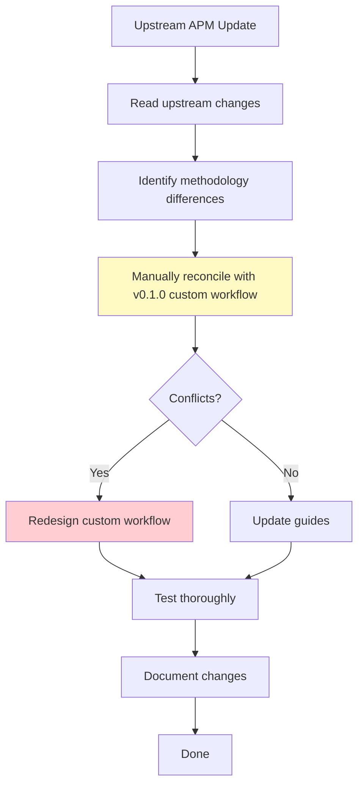
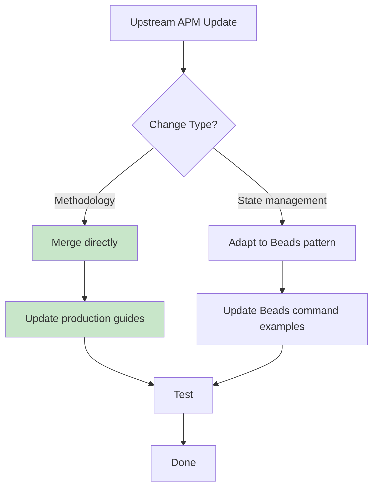

# Migration Guide: v0.1.0 → v0.2.0

**Purpose**: Guide users migrating from v0.1.0 (heavy rewrite) to v0.2.0 (surgical integration)

**TL;DR**: v0.2.0 preserves the original APM methodology almost entirely, making it easier to maintain and upgrade. If you're on v0.1.0, migrating to v0.2.0 is recommended.

---

## Table of Contents

1. [Version Overview](#version-overview)
2. [Why v0.2.0 is Better](#why-v020-is-better)
3. [What Changed](#what-changed)
4. [Migration Path](#migration-path)
5. [Deprecation Notice for v0.1.0](#deprecation-notice-for-v010)
6. [FAQ](#faq)

---

## Version Overview

### v0.1.0: Heavy Rewrite Approach (DEPRECATED)

**Philosophy**: Redesign APM methodology to integrate deeply with Beads from the ground up.

**Characteristics**:
- Extensive modifications to APM guides
- Custom workflows designed around Beads features
- Significant deviation from original APM methodology
- Difficult to sync with upstream APM updates
- 8 original APM commands replaced with custom implementations

**Status**: **DEPRECATED** - No longer maintained

**Why Deprecated**:
- Maintenance burden: Every upstream APM update requires manual reconciliation
- Methodology drift: Users familiar with original APM face steeper learning curve
- Update lag: Difficult to incorporate APM improvements quickly
- Over-engineering: Changed more than necessary for Beads integration

---

### v0.2.0: Surgical Integration Approach (CURRENT)

**Philosophy**: Preserve original APM methodology; replace only the state management layer (markdown → Beads).

**Characteristics**:
- Minimal changes to APM guides (90%+ preserved)
- Original Question Rounds, anti-packing rules, analytical challenges intact
- Easy to sync with upstream APM updates
- Users familiar with APM feel at home
- 2 streamlined commands (leveraging Beads persistence)

**Status**: **CURRENT** - Actively maintained

**Key Principle**:
> "APM's methodology is battle-tested. We're replacing the storage engine (markdown → Beads), not redesigning the car."

---

## Why v0.2.0 is Better

### 1. Preserves Original APM Methodology

**v0.1.0 Problem**:
```markdown
# v0.1.0 Context Synthesis Guide (heavily modified)

1. Initialize Beads project
2. Create context issue upfront
3. Use Beads-specific question workflow
4. Directly populate Beads fields during Q&A
```

**v0.2.0 Solution**:
```markdown
# v0.2.0 Context Synthesis Guide (original preserved)

1. Question Rounds (unchanged from original APM)
   - Round 1: Existing Material and Vision
   - Round 2: Targeted Inquiry
   - Round 3: Requirements & Process
   - Round 4: Final Validation

2. After approval, commit to Beads:
   bd create --title="Context Synthesis" --description="[synthesis]"
```

**Why Better**:
- Users who know APM can use Beads-APM immediately
- Methodology improvements in upstream APM can be merged directly
- Less documentation to maintain

---

### 2. Lighter Integration Footprint

| Aspect | v0.1.0 | v0.2.0 |
|--------|--------|--------|
| **Guides Modified** | All guides heavily rewritten | Only state management sections changed |
| **Methodology Changes** | Significant (custom workflows) | Zero (only storage changed) |
| **Lines Changed** | ~80% of guide content | ~10-20% of guide content |
| **Upstream Compatibility** | Low (manual reconciliation) | High (surgical merges) |
| **User Learning Curve** | Steep (new methodology) | Shallow (same methodology, different backend) |

**Example - Project Breakdown Guide**:

```diff
v0.1.0 Changes:
- Removed original anti-packing rules
- Added Beads-specific task creation flow
- Redesigned analytical challenge framework
- Custom review process for Beads

v0.2.0 Changes:
+ Preserved all anti-packing rules exactly
+ Preserved analytical challenge framework exactly
+ Added Beads commands after approval gates
+ Review process unchanged
```

---

### 3. Easier Upstream Synchronization

**v0.1.0 Update Process**:


**v0.2.0 Update Process**:


**Why Better**:
- Methodology updates: Copy-paste (no adaptation needed)
- State updates: Simple pattern substitution (markdown → Beads)
- Faster turnaround for upstream improvements

---

### 4. Maintains User Familiarity

**v0.1.0 Experience**:
```
User (familiar with APM): "Where are the Question Rounds?"
v0.1.0: "We redesigned that to use Beads sub-issues for each question."

User: "Why aren't the anti-packing rules working the same way?"
v0.1.0: "We adjusted them for Beads workflows."

User: "This feels like a different system."
```

**v0.2.0 Experience**:
```
User (familiar with APM): "This looks exactly like APM!"
v0.2.0: "It is! Just with better state management via Beads."

User: "Same Question Rounds, same anti-packing rules?"
v0.2.0: "Identical. Only the storage backend changed."

User: "I can use my APM knowledge immediately."
```

**Why Better**:
- Zero retraining for APM users
- Documentation references original APM without confusion
- Community knowledge transfers directly

---

### 5. Simpler Architecture

**v0.1.0 Architecture**:
```
User
 ↓
Custom Beads-APM Commands (8 commands, heavily modified)
 ↓
Custom Workflow Layer (Beads-specific logic)
 ↓
Modified APM Guides (redesigned methodology)
 ↓
Beads (state + custom features)
```

**v0.2.0 Architecture**:
```
User
 ↓
APM Commands (2 streamlined commands)
 ↓
Original APM Guides (90%+ preserved)
 ↓
Thin Adaptation Layer (markdown → Beads)
 ↓
Beads (state management only)
```

**Why Better**:
- Fewer moving parts
- Clearer separation of concerns
- Easier to debug and maintain

---

## What Changed

### Command Structure

| v0.1.0 | v0.2.0 | Change |
|--------|--------|--------|
| 8 custom commands | 2 streamlined commands | Simplified via Beads persistence |
| `/apm-1` through `/apm-8` | `/apm-setup`, `/apm-start` | Handover commands eliminated |
| Custom agent spawning | Task tool + Beads queries | Leverages Claude Code features |

**Details**:

**v0.1.0 Commands**:
1. `/apm-1-initiate-setup` - Custom setup flow
2. `/apm-2-initiate-manager` - Custom manager initialization
3. `/apm-3-initiate-implementation` - Custom implementation spawn
4. `/apm-4-initiate-adhoc` - Custom ad-hoc spawn
5. `/apm-5-handover-manager` - Custom handover protocol
6. `/apm-6-handover-implementation` - Custom handover protocol
7. `/apm-7-delegate-research` - Custom delegation
8. `/apm-8-delegate-debug` - Custom delegation

**v0.2.0 Commands**:
1. `/apm-setup` - Original setup flow + Beads state creation
2. `/apm-start` - Query Beads for state, resume work

**Why Fewer Commands**:
- Beads persists state automatically (no handover needed)
- Task tool handles agent spawning (no spawn commands needed)
- Streamlined UX while maintaining functionality

---

### Methodology Preservation

| Methodology Element | v0.1.0 | v0.2.0 |
|---------------------|--------|--------|
| Question Rounds | Modified for Beads | Preserved exactly |
| Anti-packing rules | Adjusted | Preserved exactly |
| Analytical challenges | Redesigned | Preserved exactly |
| Memory Log structure | Custom Beads schema | 1:1 mapping to comments |
| Approval gates | Modified | Preserved exactly |
| 3-attempt debug limit | Custom logic | Preserved exactly |
| Agent identity protocol | Beads-specific | Original protocol + Beads fields |

**Example - Memory Log Mapping**:

**v0.1.0** (Custom Schema):
```yaml
# Custom Beads fields
beads_status: completed
beads_agent_id: impl-001
beads_flags:
  - compatibility_concern
  - important_finding

# Custom comment sections (redesigned)
## Work Summary
[condensed overview]

## Beads Metadata
[Beads-specific tracking]
```

**v0.2.0** (1:1 Mapping):
```yaml
# Original APM frontmatter → Beads fields
status: completed           → bd update --status=done
agent: impl-agent-3         → issue assignee
has_compatibility_concerns  → label: has:compatibility-concerns

# Original APM sections → Beads comment sections (EXACT structure)
## Summary
## Details
## Output
## Issues Encountered
## Next Steps
## Compatibility Concerns (if flagged)
## Ad-Hoc Delegation (if flagged)
## Important Findings (if flagged)
```

**Why Better**:
- v0.2.0 maintains exact APM contract
- Agents don't need to learn new structure
- Export to markdown would recreate original files

---

### Guide Updates

**v0.1.0 Approach**:
```markdown
# Context_Synthesis_Guide.md (v0.1.0)

[Completely rewritten with Beads-first methodology]
- Custom question flow optimized for Beads
- Beads-specific validation steps
- Modified approval gates
```

**v0.2.0 Approach**:
```markdown
# Context_Synthesis_Guide.md (v0.2.0)

[Original APM guide preserved ~95%]

<< SECTION: State Management >>
- BEFORE: Write to Context_Synthesis.md
+ AFTER: bd create --title="Context Synthesis" --description="..."
<< END SECTION >>

[Rest of guide unchanged]
```

**Files Changed**:

| Guide | v0.1.0 Changes | v0.2.0 Changes |
|-------|----------------|----------------|
| Context_Synthesis_Guide.md | 80% rewritten | 10% modified (state sections only) |
| Project_Breakdown_Guide.md | 85% rewritten | 15% modified (state sections only) |
| Task_Assignment_Guide.md | 90% rewritten | 5% modified (examples updated) |
| Agent_Workflow_Guide.md | 75% rewritten | 20% modified (state sections + examples) |
| Memory_System_Guide.md | 95% rewritten | 10% modified (file → Beads mapping) |

---

## Migration Path

### For New Projects

**Recommendation**: Start with v0.2.0 directly.

```bash
# Remove v0.1.0 if installed
rm -rf .apm/ .claude/commands/apm-*.md .beads/

# Install v0.2.0
curl -fsSL https://raw.githubusercontent.com/emulatalk1/beads-apm-integration/main/install.sh | bash

# Verify
/apm-setup --help
```

---

### For Existing v0.1.0 Projects

**Recommendation**: Migrate to v0.2.0 for easier maintenance.

#### Step 1: Backup Current State

```bash
# Create timestamped backup
TIMESTAMP=$(date +%Y%m%d%H%M%S)
mkdir -p .migration-backup/$TIMESTAMP

# Backup v0.1.0 files
cp -r .apm/ .migration-backup/$TIMESTAMP/
cp -r .claude/commands/ .migration-backup/$TIMESTAMP/
cp -r .beads/ .migration-backup/$TIMESTAMP/

# Verify backup
ls -la .migration-backup/$TIMESTAMP/
```

#### Step 2: Export Beads Data (if you have active work)

```bash
# Export current Beads state
bd list --format=json > .migration-backup/$TIMESTAMP/beads-export.json

# Export issue details
bd show --all > .migration-backup/$TIMESTAMP/beads-issues.txt

# Export dependency graph
bd dep tree > .migration-backup/$TIMESTAMP/beads-deps.txt
```

#### Step 3: Clean Install v0.2.0

```bash
# Remove v0.1.0
rm -rf .apm/ .claude/commands/apm-*.md

# Install v0.2.0 (keeps .beads/ intact)
curl -fsSL https://raw.githubusercontent.com/emulatalk1/beads-apm-integration/main/install.sh | bash

# Verify new commands
/apm-setup
/apm-start
```

#### Step 4: Reconcile Beads Issues

If your v0.1.0 Beads issues used custom schemas:

```bash
# Review current issues
bd list

# Update issue descriptions to match v0.2.0 format
# (Original APM structure: Objective, Requirements, Done When)

bd update <issue-id> --description="
## Objective
[What this task achieves]

## Requirements
- Requirement 1
- Requirement 2

## Done When
- [ ] Criteria 1
- [ ] Criteria 2
"
```

#### Step 5: Verify Workflow

```bash
# Test setup command
/apm-setup  # Should use new v0.2.0 guides

# Test manager command
/apm-start  # Should query Beads correctly

# Verify issue format
bd show <issue-id>  # Should match APM structure
```

#### Step 6: Clean Up

```bash
# If everything works, optionally remove old backup
# (Keep for a while just in case)
# rm -rf .migration-backup/
```

---

### Migration Checklist

- [ ] Backup all v0.1.0 files to `.migration-backup/TIMESTAMP/`
- [ ] Export Beads state if you have active work
- [ ] Remove v0.1.0 APM files (`.apm/`, commands)
- [ ] Install v0.2.0 via install script
- [ ] Verify new commands work (`/apm-setup`, `/apm-start`)
- [ ] Update Beads issue descriptions to match APM format
- [ ] Test full workflow (setup → manager → implementation)
- [ ] Update team documentation if needed
- [ ] Archive old backups after confirming stability

---

## Deprecation Notice for v0.1.0

### Official Status

**v0.1.0 is DEPRECATED as of 2025-12-12.**

**Reasons**:
1. **Maintenance burden**: Every upstream APM update requires extensive manual work
2. **Methodology drift**: Deviates unnecessarily from original APM
3. **User confusion**: Creates learning curve for APM-familiar users
4. **Over-engineering**: Changed more than needed for Beads integration

**Support Timeline**:
- **2025-12-12**: v0.2.0 released, v0.1.0 deprecated
- **2026-01-12**: v0.1.0 support ends (1 month grace period)
- **2026-01-12+**: v0.1.0 documentation archived, no updates

---

### What This Means for v0.1.0 Users

**Immediate (2025-12-12 to 2026-01-12)**:
- v0.1.0 continues to work
- No new features for v0.1.0
- Critical bugs may be fixed on a case-by-case basis
- Migration support available

**After 2026-01-12**:
- No bug fixes for v0.1.0
- Documentation moved to `/docs/archive/v0.1.0/`
- All users expected to migrate to v0.2.0

---

### Migration Incentives

**Why Migrate Now**:

1. **Easier maintenance**: v0.2.0 gets upstream APM updates automatically
2. **Better UX**: Familiar APM workflow, just better storage
3. **Future-proof**: Active development on v0.2.0
4. **Less complexity**: Simpler architecture, fewer bugs

**Migration Effort**: ~30 minutes for most projects

**Risk**: Low (v0.2.0 preserves methodology, only changes storage)

---

## FAQ

### Q: I'm new to Beads-APM. Which version should I use?

**A**: Start with v0.2.0. It's the current version and easier to learn if you know original APM.

---

### Q: I have an active v0.1.0 project. Should I migrate mid-project?

**A**:

**If project < 50% complete**: Migrate now. Small effort, long-term benefit.

**If project > 50% complete**: Finish on v0.1.0, migrate for next project.

**If you need new APM features**: Migrate immediately (v0.2.0 syncs with upstream APM).

---

### Q: What happens to my v0.1.0 Beads data during migration?

**A**:

Your `.beads/` directory stays intact. You just need to:
1. Update issue descriptions to match APM format
2. Ensure comments use the 5+3 section structure

The install script doesn't touch `.beads/`.

---

### Q: Can I use both v0.1.0 and v0.2.0 in different projects?

**A**:

Technically yes, but **not recommended**. Switching between versions creates confusion.

Better approach:
- Migrate all projects to v0.2.0
- Archive v0.1.0 projects if migration isn't worth it

---

### Q: Will original APM users understand v0.2.0?

**A**:

**Yes!** That's the entire point of v0.2.0.

Original APM users will recognize:
- Same Question Round structure
- Same anti-packing rules
- Same analytical challenges
- Same Memory Log format

The only difference: State lives in Beads instead of markdown files.

---

### Q: What if I customized v0.1.0 guides?

**A**:

If you customized methodology:
1. Document your changes
2. Apply same changes to v0.2.0 guides
3. Use `dev/` directory workflow (see DEVELOPMENT.md)

If you only changed state management:
- v0.2.0 already does this better
- Review v0.2.0 approach, likely no custom changes needed

---

### Q: How do I get help with migration?

**A**:

1. **Documentation**: Read this guide + `dev/docs/comparison/apm-to-beads-changes.md`
2. **Issues**: Open GitHub issue with "migration" label
3. **Examples**: See `dev/tests/test-scenarios.md` for v0.2.0 workflows

---

### Q: What about the 8 original APM commands?

**A**:

Original APM (upstream) has 8 commands because it uses markdown files that need manual handover.

**v0.1.0**: Kept 8 commands but heavily modified them for Beads.

**v0.2.0**: Reduced to 2 commands because Beads persists state automatically (no handover needed).

The 2 v0.2.0 commands cover all functionality of the original 8.

---

### Q: Can I contribute to v0.1.0?

**A**:

No. v0.1.0 is deprecated and no longer accepting contributions.

**Instead**: Contribute to v0.2.0 on GitHub.

---

### Q: How do I check which version I have?

**v0.1.0 indicators**:
```bash
# Has 8 commands
ls .claude/commands/apm-*
# Output: apm-1.md, apm-2.md, ..., apm-8.md

# Guides heavily modified
grep "Beads-first" .apm/guides/*.md  # Found in v0.1.0
```

**v0.2.0 indicators**:
```bash
# Has 2 commands
ls .claude/commands/apm-*
# Output: apm-setup.md, apm-start.md

# Guides mostly original APM
grep "Question Round" .apm/guides/Context_Synthesis_Guide.md  # Preserved in v0.2.0
```

---

## Conclusion

### Summary

| Aspect | v0.1.0 | v0.2.0 |
|--------|--------|--------|
| **Philosophy** | Redesign APM for Beads | Preserve APM, adapt storage |
| **Methodology Changes** | Significant | Zero |
| **Maintenance** | High burden | Low burden |
| **Upstream Sync** | Difficult | Easy |
| **User Learning Curve** | Steep | Shallow |
| **Commands** | 8 custom | 2 streamlined |
| **Status** | Deprecated | Current |

### Recommendation

**For all users**: Migrate to v0.2.0.

**Why**:
- Lighter integration (preserves original APM)
- Easier to maintain (syncs with upstream)
- Better user experience (familiar methodology)
- Future-proof (active development)

### Next Steps

1. **New users**: Install v0.2.0 directly
2. **v0.1.0 users**: Follow migration path above
3. **Questions**: Read FAQ, check docs, open GitHub issue

---

**Document Version**: 1.0
**Created**: 2025-12-12
**Status**: Official Migration Guide
**Maintained by**: Beads-APM Integration Team
