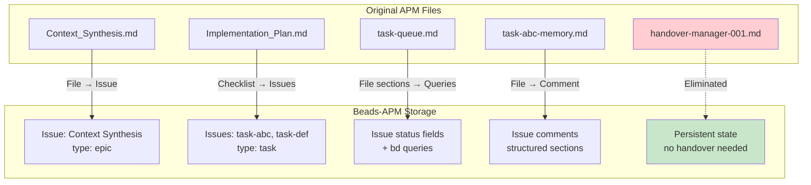
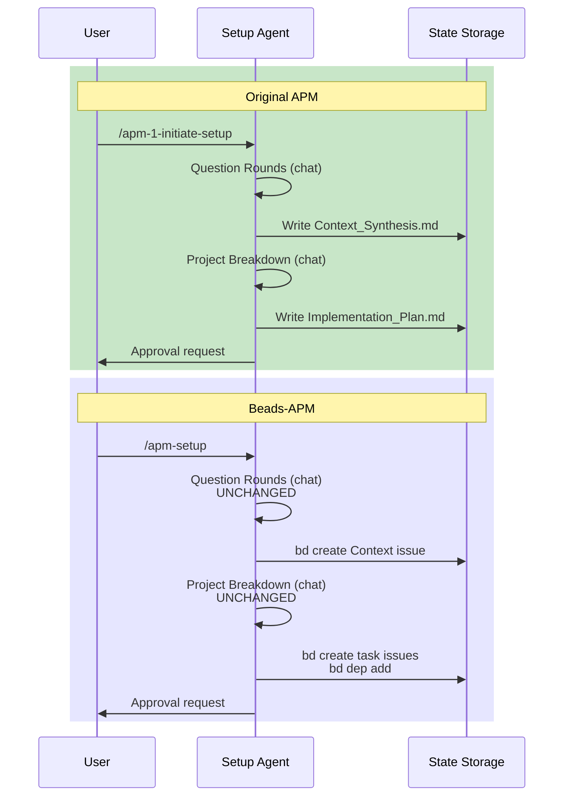
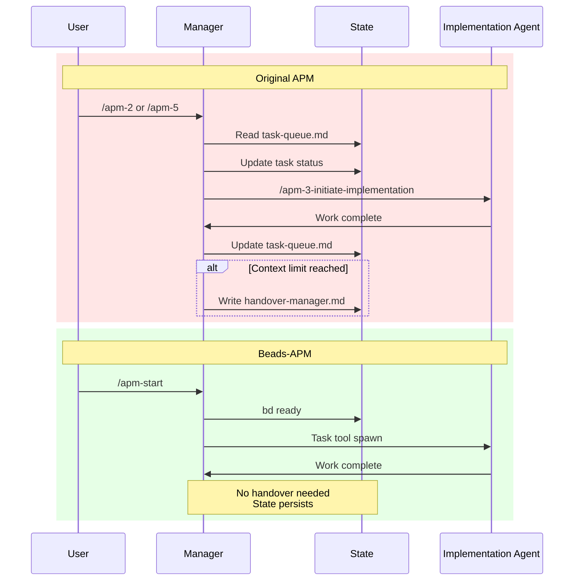
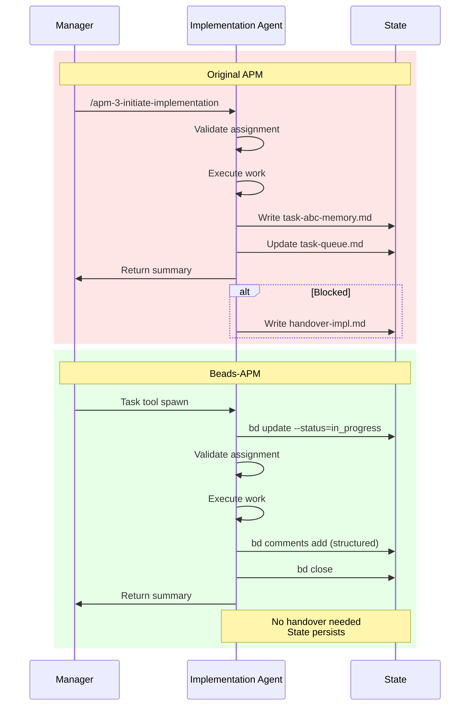
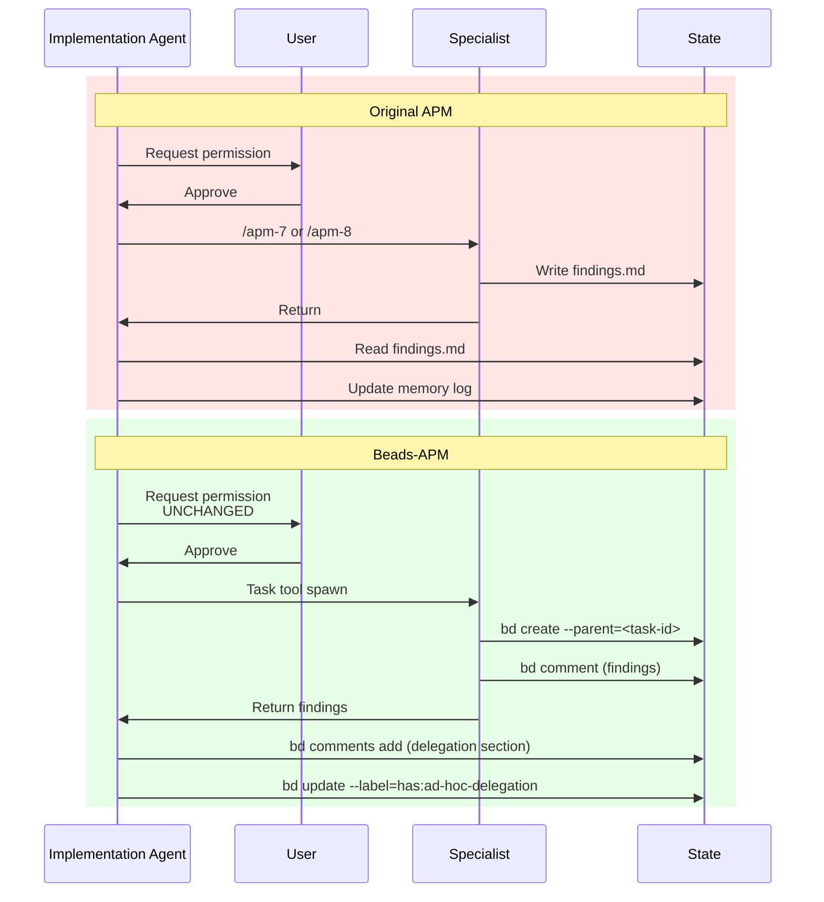
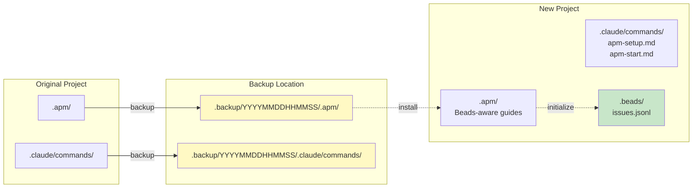
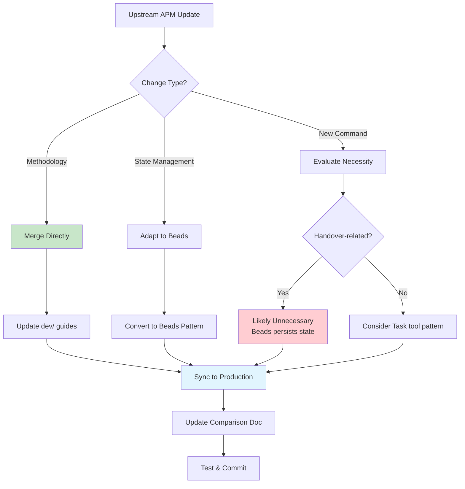

# APM to Beads-APM: Transformation Documentation

**Version**: v0.2.0
**Date**: 2025-12-12
**Purpose**: Document changes from original APM for future reference and maintenance

---

## Table of Contents

1. [Overview](#overview)
2. [Command Structure Changes](#command-structure-changes)
3. [State Management Transformation](#state-management-transformation)
4. [Workflow Changes](#workflow-changes)
5. [Architecture Comparison](#architecture-comparison)
6. [Migration Implications](#migration-implications)
7. [Future Maintenance Guide](#future-maintenance-guide)

---

## Overview

### What Changed and Why

This document captures the surgical transformation from **original APM** (markdown-based state management) to **Beads-APM** (Beads-based state management). The core APM methodology remains preserved; only the state persistence layer was replaced.

### Version History

| Version | State Management | Command Count | Handover Method | Status |
|---------|------------------|---------------|-----------------|---------|
| **Original APM v0.1.0** | Markdown files | 8 commands | Markdown documents | Upstream |
| **Beads-APM v0.2.0** | Beads issue tracker | 2 commands | Persistent Beads state | This repo |

### Critical Principle

**APM's methodology is battle-tested.** Our job was surgical replacement of state management (markdown → Beads), NOT redesigning the methodology. All question rounds, anti-packing guardrails, analytical challenges, and approval gates remain unchanged.

---

## Command Structure Changes

### Original APM: 8 Commands

The original APM uses 8 slash commands for phase-specific agent initialization and handover:

```mermaid
graph TD
    A[User] --> B[/apm-1-initiate-setup]
    A --> C[/apm-2-initiate-manager]
    A --> D[/apm-3-initiate-implementation]
    A --> E[/apm-4-initiate-adhoc]
    A --> F[/apm-5-handover-manager]
    A --> G[/apm-6-handover-implementation]
    A --> H[/apm-7-delegate-research]
    A --> I[/apm-8-delegate-debug]

    B --> J[Setup Agent]
    C --> K[Manager Agent]
    D --> L[Implementation Agent]
    E --> M[Ad-Hoc Agent]
    F --> K
    G --> L
    H --> N[Research Agent]
    I --> O[Debug Agent]

    style B fill:#e1f5ff
    style C fill:#e1f5ff
    style D fill:#e1f5ff
    style E fill:#e1f5ff
    style F fill:#ffe1e1
    style G fill:#ffe1e1
    style H fill:#fff4e1
    style I fill:#fff4e1
```

| Command | Purpose | Agent Type |
|---------|---------|------------|
| `/apm-1-initiate-setup` | Start Context Synthesis + Project Breakdown | Setup Agent |
| `/apm-2-initiate-manager` | Start Manager for task orchestration | Manager Agent |
| `/apm-3-initiate-implementation` | Start Implementation Agent for task execution | Implementation Agent |
| `/apm-4-initiate-adhoc` | Start ad-hoc specialists (research/debug) | Ad-Hoc Agent |
| `/apm-5-handover-manager` | Transfer Manager state between sessions | Manager Agent |
| `/apm-6-handover-implementation` | Transfer Implementation state between sessions | Implementation Agent |
| `/apm-7-delegate-research` | Delegate to Research Agent | Research Agent |
| `/apm-8-delegate-debug` | Delegate to Debug Agent | Debug Agent |

**Handover Pattern**: Original APM requires explicit handover commands because state lives in markdown files that need manual synchronization between sessions.

### Beads-APM: 2 Commands

Beads-APM consolidates to 2 commands because persistent state eliminates handover needs:

```mermaid
graph TD
    A[User] --> B[/apm-setup]
    A --> C[/apm-start]

    B --> D[Setup Agent]
    C --> E[Manager Agent]

    E -->|Task tool| F[Implementation Agent]
    F -->|Task tool| G[Research Agent]
    F -->|Task tool| H[Debug Agent]

    D -.->|bd create| I[(Beads)]
    E -.->|bd query/update| I
    F -.->|bd update/comment| I
    G -.->|bd comment| I
    H -.->|bd comment| I

    style B fill:#c8e6c9
    style C fill:#c8e6c9
    style I fill:#fff9c4
```

| Command | Purpose | Replaces |
|---------|---------|----------|
| `/apm-setup` | Initialize project with Context Synthesis + Project Breakdown | `/apm-1-initiate-setup` |
| `/apm-start` | Resume Manager or start work (queries Beads for state) | `/apm-2-initiate-manager`, `/apm-5-handover-manager` |

**Implementation/Ad-Hoc Agents**: Spawned via Claude Code's Task tool instead of dedicated commands. The Task tool provides proper session isolation, and Beads provides persistent state.

### Command Transformation Flow

```mermaid
flowchart LR
    subgraph "Original APM"
        A1[/apm-1-initiate-setup]
        A2[/apm-2-initiate-manager]
        A3[/apm-3-initiate-implementation]
        A4[/apm-4-initiate-adhoc]
        A5[/apm-5-handover-manager]
        A6[/apm-6-handover-implementation]
        A7[/apm-7-delegate-research]
        A8[/apm-8-delegate-debug]
    end

    subgraph "Beads-APM"
        B1[/apm-setup]
        B2[/apm-start]
        B3[Task tool spawn]
        B4[State persists]
    end

    A1 -->|Methodology preserved| B1
    A2 -->|Unified command| B2
    A3 -->|Programmatic spawn| B3
    A4 -->|Programmatic spawn| B3
    A5 -.->|Eliminated| B4
    A6 -.->|Eliminated| B4
    A7 -->|Programmatic spawn| B3
    A8 -->|Programmatic spawn| B3

    style A5 fill:#ffcdd2
    style A6 fill:#ffcdd2
    style B4 fill:#c8e6c9
```

### Why 8 → 2 Commands

**Eliminated Commands and Reasoning**:

1. **`/apm-3-initiate-implementation`** → Replaced by Task tool spawn
   - Manager spawns Implementation Agents programmatically
   - Task tool provides session isolation
   - Beads provides persistent context

2. **`/apm-4-initiate-adhoc`** → Replaced by Task tool spawn
   - Implementation Agents spawn specialists as needed
   - Same Task tool pattern

3. **`/apm-5-handover-manager`** → Eliminated (no handover needed)
   - Beads persists all Manager state
   - New sessions query: `bd stats`, `bd ready`, `bd list --status=in_progress`

4. **`/apm-6-handover-implementation`** → Eliminated (no handover needed)
   - Beads persists work logs via comments
   - New agents query: `bd show <id>`, `bd comments <id>`

5. **`/apm-7-delegate-research`** → Replaced by Task tool spawn
   - Implementation Agent spawns via Task tool
   - Context passed in prompt

6. **`/apm-8-delegate-debug`** → Replaced by Task tool spawn
   - Same as research delegation

---

## State Management Transformation

### Original APM: Markdown Files

**State Storage Pattern**:
```
.apm/
├── docs/
│   ├── Context_Synthesis.md        # Requirements from setup
│   ├── Implementation_Plan.md      # Task breakdown
│   └── Project_Breakdown.md        # Initial structure
├── state/
│   ├── task-queue.md                # Active task list (Manager)
│   └── project-status.md            # High-level status
├── memory/
│   ├── task-abc-memory.md           # Implementation logs
│   ├── task-def-memory.md
│   └── ...
└── handover/
    ├── handover-manager-001.md      # Session transfer docs
    ├── handover-impl-002.md
    └── ...
```

**Characteristics**:
- State scattered across multiple markdown files
- Manual file creation/updates via Write tool
- Handover requires creating transfer documents
- State can drift (file not updated = lost state)
- No queryable state (must read entire files)
- Checklists via markdown `- [ ]` syntax

### Beads-APM: Beads Issue Tracker

**State Storage Pattern**:
```
.beads/
├── issues.jsonl                     # All issues (native Beads)
├── config.json                      # Beads configuration
└── metadata/                        # Issue attachments/metadata
```

**Characteristics**:
- State centralized in Beads database
- Programmatic updates via `bd` commands
- No handover (state persists automatically)
- State always current (atomic updates)
- Queryable state (`bd ready`, `bd blocked`, `bd stats`)
- Status tracking via Beads fields

### State Mapping Visualization



### State Mapping: Markdown → Beads

#### 1. Context Synthesis

**Original APM**:
```markdown
# .apm/docs/Context_Synthesis.md
---
date: 2024-01-15
---

## Project Vision
[User's requirements from Question Rounds]

## Key Requirements
- Requirement 1
- Requirement 2

## Technical Constraints
- Constraint 1
```

**Beads-APM**:
```bash
bd create --title="Context Synthesis" --type=epic \
  --description="## Project Vision
[User's requirements]

## Key Requirements
- Requirement 1
- Requirement 2

## Technical Constraints
- Constraint 1"
```

**Mapping**:
- File → Beads issue (type: epic)
- Frontmatter → Beads fields
- Content → Issue description

---

#### 2. Task Queue

**Original APM**:
```markdown
# .apm/state/task-queue.md
---
updated: 2024-01-15T10:30:00Z
---

## Ready Tasks
- [ ] task-abc: Implement authentication
- [ ] task-def: Setup database schema

## In Progress
- [x] task-ghi: Setup project structure (agent: impl-1)

## Completed
- [x] task-jkl: Initial setup
```

**Beads-APM**:
```bash
# Query ready work
bd ready

# Query in-progress work
bd list --status=in_progress

# Query completed work
bd list --status=done
```

**Mapping**:
- Markdown checklist → Beads status field
- File sections → Beads queries
- Manual updates → Atomic `bd update` commands

---

#### 3. Memory Logs (Implementation Agent Work Logs)

**Original APM** (`.apm/memory/task-abc-memory.md`):
```markdown
---
status: completed
agent: impl-agent-3
task_ref: proj-abc
has_compatibility_concerns: false
has_ad_hoc_delegation: true
has_important_findings: false
---

## Summary
Implemented user authentication using JWT tokens. Created login/logout endpoints.

## Details
- Created AuthService with token generation
- Added middleware for route protection
- Integrated with existing User model

## Output
- File: /src/services/AuthService.ts (lines 1-120)
- File: /src/middleware/authMiddleware.ts (lines 1-45)

## Issues Encountered
1. Token expiry handling
   - Solution: Used refresh token pattern

## Next Steps
- [ ] Add password reset flow
- [ ] Add email verification

## Ad-Hoc Delegation
- Agent Type: Research
- Reason: Investigate OAuth2 integration options
- Outcome: Recommended using Passport.js for future work
```

**Beads-APM**:
```bash
# Update status
bd update proj-abc --status=done

# Add labels for flags
bd update proj-abc --label="has:ad-hoc-delegation"

# Add structured comment with exact same sections
bd comments add proj-abc --comment="## Summary
Implemented user authentication using JWT tokens. Created login/logout endpoints.

## Details
- Created AuthService with token generation
- Added middleware for route protection
- Integrated with existing User model

## Output
- File: /src/services/AuthService.ts (lines 1-120)
- File: /src/middleware/authMiddleware.ts (lines 1-45)

## Issues Encountered
1. Token expiry handling
   - Solution: Used refresh token pattern

## Next Steps
- [ ] Add password reset flow
- [ ] Add email verification

## Ad-Hoc Delegation
- Agent Type: Research
- Reason: Investigate OAuth2 integration options
- Outcome: Recommended using Passport.js for future work"
```

**Mapping** (1:1 Surgical):
| Original APM | Beads-APM |
|-------------|-----------|
| YAML frontmatter: `status` | `bd update --status=` |
| YAML: `agent` | Issue assignee or label |
| YAML: `task_ref` | Issue ID (native) |
| YAML: `has_*` flags | Labels: `has:compatibility-concerns`, etc. |
| Markdown sections (5+3) | Comment sections (exact same structure) |

**Critical**: All 8 sections (5 required + 3 conditional) preserved exactly.

---

#### 4. Handover Documents

**Original APM** (`.apm/handover/handover-manager-001.md`):
```markdown
---
from_session: manager-session-001
to_session: manager-session-002
handover_reason: context_window_limit
timestamp: 2024-01-15T14:30:00Z
---

## Current State
- 15 tasks total
- 3 in progress
- 8 completed
- 4 ready

## Active Agents
- impl-agent-1: Working on task-abc (auth)
- impl-agent-2: Working on task-def (database)

## Recent Decisions
- Prioritized auth over UI work
- Split database task into schema + migrations

## Blocked Items
- task-xyz: Waiting for API key from client

## Next Actions
1. Check on impl-agent-1 progress
2. Assign task-ghi when agent available
```

**Beads-APM**:
```bash
# No handover document needed. New session queries state:

bd stats                           # Current state overview
bd list --status=in_progress       # Active work
bd ready                           # What's ready
bd blocked                         # What's blocked
bd comments <coordination-id>      # Recent decisions

# All information persists automatically
```

**Mapping**:
- Handover file → **Eliminated entirely**
- State sections → Beads queries
- Context transfer → Automatic (state persists)

---

## Workflow Changes

### Setup Phase (Context Synthesis + Project Breakdown)



**What Changed**:
- Command name simplified
- Markdown files → Beads issues
- Checklist → Individual issues with dependencies

**What Stayed Same**:
- Question Round iteration structure
- Analytical challenge framework
- Anti-packing guardrails (15-task limit, 90-min tasks)
- User approval gates

---

### Manager Phase (Task Orchestration)



**What Changed**:
- Unified command (no separate handover)
- File read/write → Beads queries
- Slash command spawn → Task tool spawn
- Handover documents eliminated

**What Stayed Same**:
- Task selection algorithm (priority, effort, dependencies)
- Workload balancing rules
- Cross-agent context packaging
- Manager doesn't execute implementation work

---

### Implementation Phase (Task Execution)



**What Changed**:
- Task tool instead of slash command
- Explicit status updates
- Memory log file → Beads comment (same structure)
- Handover eliminated

**What Stayed Same**:
- Agent identity registration pattern
- Memory Log structure (all 8 sections: 5 required + 3 conditional)
- Boolean flag logic (compatibility, delegation, findings)
- 3-attempt debug limit
- Task Report format for user

---

### Ad-Hoc Delegation (Research/Debug Agents)



**What Changed**:
- Task tool instead of slash commands
- Child issue creation for tracking
- Findings via Beads instead of markdown
- Label for delegation flag

**What Stayed Same**:
- User confirmation requirement (NEVER skipped)
- 3-step workflow: Request → Confirm → Isolate
- Session isolation (now via Task tool)
- Findings integration pattern
- Re-delegation protocol

---

## Architecture Comparison

### Original APM Architecture

```mermaid
graph TB
    subgraph "User Interface"
        U[User - Claude Code CLI]
    end

    subgraph "Commands Layer"
        C1[/apm-1-initiate-setup]
        C2[/apm-2-initiate-manager]
        C3[/apm-3-initiate-implementation]
        C4[/apm-4-initiate-adhoc]
        C5[/apm-5-handover-manager]
        C6[/apm-6-handover-implementation]
        C7[/apm-7-delegate-research]
        C8[/apm-8-delegate-debug]
    end

    subgraph "Agents Layer"
        A1[Setup Agent]
        A2[Manager Agent]
        A3[Implementation Agent]
        A4[Research Agent]
        A5[Debug Agent]
    end

    subgraph "State Layer - Markdown Files"
        S1[docs/Context_Synthesis.md]
        S2[docs/Implementation_Plan.md]
        S3[state/task-queue.md]
        S4[memory/task-*-memory.md]
        S5[handover/handover-*.md]
    end

    U --> C1 & C2 & C3 & C4 & C5 & C6 & C7 & C8
    C1 --> A1
    C2 & C5 --> A2
    C3 & C6 --> A3
    C7 --> A4
    C8 --> A5

    A1 --> S1 & S2
    A2 --> S3 & S5
    A3 --> S3 & S4 & S5
    A4 & A5 --> S4

    style S5 fill:#ffcdd2
    style C5 fill:#ffcdd2
    style C6 fill:#ffcdd2
```

**Characteristics**:
- State scattered in markdown files
- Manual file synchronization between sessions
- Handover documents for session transfer
- 8 commands for different phases/handovers

---

### Beads-APM Architecture

```mermaid
graph TB
    subgraph "User Interface"
        U[User - Claude Code CLI]
    end

    subgraph "Commands Layer"
        C1[/apm-setup]
        C2[/apm-start]
    end

    subgraph "Orchestration Layer"
        T[Task Tool<br/>Session Isolation]
    end

    subgraph "Agents Layer"
        A1[Setup Agent]
        A2[Manager Agent]
        A3[Implementation Agent]
        A4[Research Agent]
        A5[Debug Agent]
    end

    subgraph "State Layer - Beads"
        B[(Beads Issue Tracker)]
        Q1[bd ready]
        Q2[bd blocked]
        Q3[bd stats]
        Q4[bd comments]
    end

    U --> C1 & C2
    C1 --> A1
    C2 --> A2

    A2 -->|spawn| T
    A3 -->|spawn| T
    T -.-> A3 & A4 & A5

    A1 -->|bd create| B
    A2 -->|bd query/update| B
    A3 -->|bd update/comment| B
    A4 & A5 -->|bd comment| B

    B --> Q1 & Q2 & Q3 & Q4

    style B fill:#fff9c4
    style T fill:#e1f5fe
    style C1 fill:#c8e6c9
    style C2 fill:#c8e6c9
```

**Characteristics**:
- State centralized in Beads database
- Automatic state persistence (no handover)
- Queryable state (no full file reads)
- 2 commands (Task tool for agent spawning)
- Task tool provides session isolation

---

## Migration Implications

### For Users Migrating from Original APM

**Backup Structure**:



**What Gets Backed Up**:
```
.backup/
└── YYYYMMDDHHMMSS/           # Timestamp-based backup
    ├── .apm/
    │   ├── docs/              # Original synthesis/plans
    │   ├── state/             # Original task queue
    │   ├── memory/            # Original work logs
    │   └── handover/          # Original handover docs
    └── .claude/
        └── commands/          # Original 8 APM commands
            ├── apm-1-initiate-setup.md
            ├── apm-2-initiate-manager.md
            ├── apm-3-initiate-implementation.md
            ├── apm-4-initiate-adhoc.md
            ├── apm-5-handover-manager.md
            ├── apm-6-handover-implementation.md
            ├── apm-7-delegate-research.md
            └── apm-8-delegate-debug.md
```

**Manual Migration Required**:
If user has existing tasks in `Implementation_Plan.md`:

```bash
# 1. Review old plan
cat .backup/YYYYMMDDHHMMSS/.apm/docs/Implementation_Plan.md

# 2. Create Beads issues for each task
bd create --title="Task name" --type=task \
  --description="Objective, requirements, done-when"

# 3. Add dependencies
bd dep add <consumer-id> <producer-id>

# 4. Verify structure
bd stats
bd ready
bd dep cycles
```

**What Works Immediately**:
- `/apm-setup` - Fresh setup works out of box
- `/apm-start` - Works once Beads issues exist
- All APM methodology guides (updated for Beads)

---

### For Maintainers When Upstream APM Updates

**Update Integration Flow**:



**Decision Matrix**:

| Upstream Change Type | Action |
|---------------------|--------|
| New Question Round structure | Merge directly (no adaptation needed) |
| New anti-packing rule | Merge directly (no adaptation needed) |
| New markdown file for state | Convert to Beads equivalent (issue/comment/label) |
| New handover protocol | Evaluate if Beads makes it unnecessary |
| New agent delegation pattern | Convert slash command to Task tool pattern |
| New Memory Log section | Add to Beads comment structure (preserve 1:1 mapping) |

---

## Future Maintenance Guide

### When to Update This Document

Update this comparison when:

1. **Upstream APM changes**:
   - New methodology patterns added
   - Command structure changes
   - New state management patterns

2. **Beads-APM enhancements**:
   - New Beads features used
   - Command consolidation
   - Workflow optimizations

3. **Breaking changes**:
   - Command signatures change
   - State mapping changes
   - Migration path changes

### Version Tracking

Each update should include:
```markdown
**Version**: v0.X.0
**Date**: YYYY-MM-DD
**Changes**:
- What changed in original APM
- How we adapted it
- New mappings or eliminations
```

### Testing Changes

Before declaring integration complete:

1. **Methodology Preservation Test**:
   - Run `/apm-setup` → Verify Question Rounds work identically
   - Check anti-packing rules enforced
   - Confirm analytical challenges present

2. **State Mapping Test**:
   - Create test task → Verify Beads issue created correctly
   - Add dependencies → Verify `bd dep` works
   - Log work → Verify comment structure matches Memory Log

3. **Workflow Continuity Test**:
   - Run full Setup → Manager → Implementation flow
   - Verify Task tool spawning works
   - Confirm no handover needed between sessions

4. **Migration Test**:
   - Simulate original APM project
   - Run installer migration path
   - Verify backup created correctly
   - Confirm Beads issues match markdown state

---

## Quick Reference Tables

### Command Mapping

| Original APM Command | Beads-APM Replacement | Notes |
|---------------------|----------------------|-------|
| `/apm-1-initiate-setup` | `/apm-setup` | Same workflow, creates Beads issues |
| `/apm-2-initiate-manager` | `/apm-start` | Queries Beads for state |
| `/apm-3-initiate-implementation` | Task tool spawn | Manager spawns Implementation Agents |
| `/apm-4-initiate-adhoc` | Task tool spawn | Impl Agents spawn specialists |
| `/apm-5-handover-manager` | Eliminated | Beads persists state automatically |
| `/apm-6-handover-implementation` | Eliminated | Beads persists work logs |
| `/apm-7-delegate-research` | Task tool spawn | Context passed in prompt |
| `/apm-8-delegate-debug` | Task tool spawn | Context passed in prompt |

### State File Mapping

| Original APM File | Beads-APM Equivalent | Access Pattern |
|------------------|---------------------|---------------|
| `.apm/docs/Context_Synthesis.md` | Beads issue (type: epic) | `bd show <context-id>` |
| `.apm/docs/Implementation_Plan.md` | Multiple Beads issues | `bd list`, `bd stats` |
| `.apm/state/task-queue.md` | Beads status queries | `bd ready`, `bd blocked` |
| `.apm/memory/task-*-memory.md` | Beads comments | `bd comments <id>` |
| `.apm/handover/handover-*.md` | Eliminated | State persists automatically |

### Memory Log Section Mapping

| Memory Log Section | Beads Location | Type |
|-------------------|---------------|------|
| YAML frontmatter: `status` | Issue status field | `bd update --status=` |
| YAML: `agent` | Issue assignee | `bd update --assignee=` |
| YAML: `task_ref` | Issue ID | Native field |
| YAML: `has_*` flags | Issue labels | `bd update --label=` |
| Markdown: "Summary" | Comment section | Text in `bd comments add` |
| Markdown: "Details" | Comment section | Text in `bd comments add` |
| Markdown: "Output" | Comment section | Text in `bd comments add` |
| Markdown: "Issues Encountered" | Comment section | Text in `bd comments add` |
| Markdown: "Next Steps" | Comment section | Text in `bd comments add` |
| Markdown: "Compatibility Concerns" | Comment section (conditional) | If has:compatibility-concerns label |
| Markdown: "Ad-Hoc Delegation" | Comment section (conditional) | If has:ad-hoc-delegation label |
| Markdown: "Important Findings" | Comment section (conditional) | If has:important-findings label |

---

## Preservation Checklist

When integrating upstream APM changes, verify:

- [ ] Question Round structure unchanged
- [ ] Anti-packing guardrails present (15-task limit, 90-min tasks)
- [ ] Analytical Challenge framework intact
- [ ] User approval gates maintained
- [ ] Memory Log structure preserved (5+3 sections)
- [ ] Chat-to-file interleaving pattern (now chat-to-Beads)
- [ ] Same-agent vs cross-agent context distinction
- [ ] 3-attempt debug limit
- [ ] Agent identity registration protocol
- [ ] Ad-hoc delegation workflow (3 steps: Request → Confirm → Isolate)

---

## Conclusion

### Summary of Changes

**8 → 2 Commands**: Eliminated handover commands and consolidated agent spawning via Task tool.

**Markdown → Beads**: Surgically replaced file-based state with queryable Beads issues, comments, and status tracking.

**Handover → Persistent**: Removed all handover documents; state persists automatically across sessions.

### Methodology Preservation

**Zero methodology changes**. All Question Rounds, anti-packing rules, analytical challenges, and approval gates remain exactly as designed in original APM.

### Maintenance Philosophy

When original APM updates:
1. **Methodology changes** → Merge directly
2. **State management changes** → Adapt to Beads equivalent
3. **Update this document** → Keep comparison current

This transformation makes APM more robust (persistent state) while preserving its battle-tested methodology.

---

**Document Version**: 1.0
**Last Updated**: 2025-12-12
**Maintainer**: Beads-APM Integration Team
